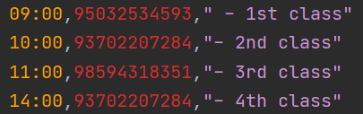
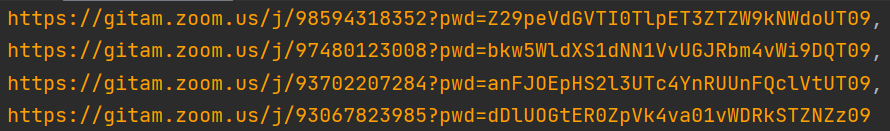

# Story Time 
In India, due to the pandemic COVID-19 situation , institutes are conducting  online classes 😒.

Just like everyone 🤷‍♂️ , even I was attending allllll the classes like other students , which was manually 😢 meaning "we"(students) had to open the PORTAL which was provided to us by our COLLEGE and there all the links of the classes RESIDED and we had to login to the meeting  according to the TIMETABLE given to us by our college.

But then suddenly out of blue ,one of my classmate messaged me this . 


# Task 📝

She asked me if i could build a Zoom bot for her which logs in for her automatically into the classes , provided she provides all the links and the timings of the classes in prior.

Because I was interested in learning automations , therefore took this task and built one 😎 .

# Prerequisites ✔✔✔

* Install "Zoom Desktop app" in your system and also know the path of it.


# Setup instructions ✍🧐 #
* Clone the Github repo
```
git clone https://github.com/Kabir079/Zoom-Bot-Windows-OS-.git
```

* cd into the directory

* Install required libraries (using IDE's terminal or use Command Prompt):
```
pip3 install pyautogui
```

### Note : For CSV file ### ❕❕
* Update the timings.csv with the time of the "time of the meeting" (24 hr format) , Meeting Id and password.
* Do not add any additional spaces.(Do not open the csv using excel as it changes the formatting)
* The links must be feeded in the "ascending order" in respect of time .
# Example : #



* time.sleep() function works with a parameter = seconds. 
#### Example : When you write time.sleep(60) ####
 Here "60" , it means "60 seconds" .
 
### Note : Operating System ### ❗❗
This bot is only specifically made for Window OS . But if changes are made in "Source code" , according to the targetted OS , then this bot shall work.
(provided there are no errors in the changes which were made)\

# Helper code 
Description : This code is made to ease the task , comfort the user and save time in writting the Meeting link with time (in ascending order) in the Zoom bot's csv file . Usually when such a proper syntax is needed in csv files , people usually make mistakes with giving extra commas or extra spaces . Therfore , I build this "Helper code" which assists the Zoom bot .
1. To use this , the user shall open the folder "helper_folder" present in this repo and then he/she shall create a new project/file where the code and the csv must be included .
2. Csv file is where the user must paste the links of the class , just like the below link.



3. Now , run the code . 
4. The result of the code is what the user can copy paste in the zoom bot's csv file and can run bot in no time .

# Working 🏃‍♂️ 🚀
1. Extract the Meeting Id from Meeting link of the class which you target to attend and paste it in the CSV file .Also mention the timing (Do not change the format of CSV file which is Time,Meeting ID,--1st class
2. Check if the time.sleep() in "78","83","88","93" is equal to that of the interval/difference between the links which you have provided in the csv file.
3. Go ahead and run the code and Enjoy LAZYNESSSS😂😂

# Advice - Fullscreen mode
* If the user wants the Zoom app to be opened in fullscreen mode , the user must quit the zoom in fullscreen mode before running the bot [Once this is done , the next time Zoom app will open in the fullscreen mode].

# Things to "NOT TO DO" , when bot is working 
* When the bot opens Zoom app , do not move your cursor . The bot is programmed to perform some actions by using cursor .
* This Bot is not programmed to End/Leave the meeting/class, though the user if wants that functionallity too , he/she can add that function too by making changes according .
 I haven't programmed the BOT to End/Leave the meeting/class because mostly people would like to manually End/Leave  which is dictated by that person's mood .
* The user must make sure that after logging out of the Meeting/Class , he/she should check if Zoom app is running in background . If it is running , the user must close it properly , before the next meeting/class time .
